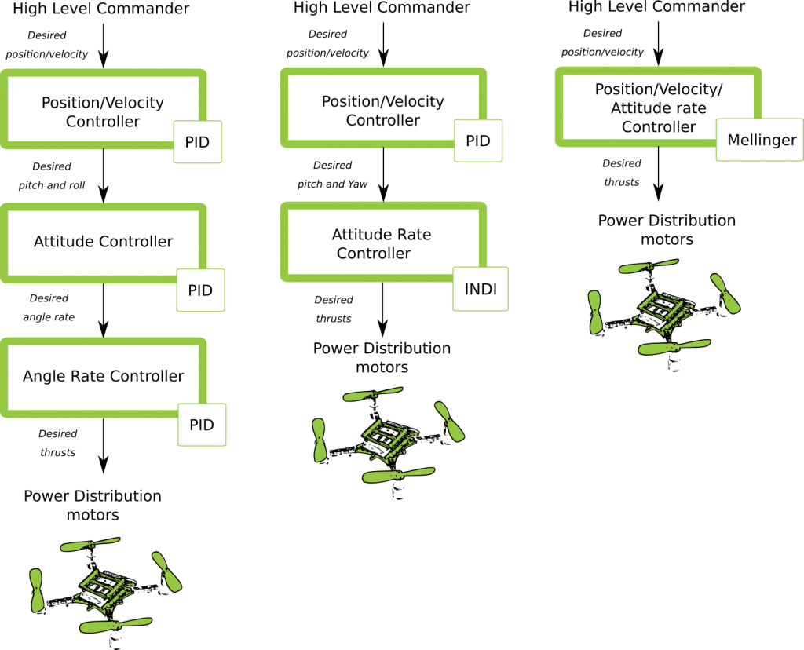

## 已支持的控制器

ESP-Drone 控制系统代码来自 `crazyflie`，也继承了该工程的所有控制算法，需要注意的是，ESP-Drone 仅对 PID 控制器进行了参数整定和测试，换用其它控制器时，请在确保安全的情况下，自行进行参数整定。



详情请参考：[https://www.bitcraze.io/2020/02/out-of-control/](https://www.bitcraze.io/2020/02/out-of-control/)

可在代码中,通过修改 `controllerInit(ControllerType controller)` 的传入参数，对控制器进行切换。

也可通过实现以下控制器接口，添加自定义的控制器：

```
static ControllerFcns controllerFunctions[] = {
  {.init = 0, .test = 0, .update = 0, .name = "None"}, // Any
  {.init = controllerPidInit, .test = controllerPidTest, .update = controllerPid, .name = "PID"},
  {.init = controllerMellingerInit, .test = controllerMellingerTest, .update = controllerMellinger, .name = "Mellinger"},
  {.init = controllerINDIInit, .test = controllerINDITest, .update = controllerINDI, .name = "INDI"},
};
```

## PID控制器

**控制原理**

PID 控制器（比例-积分-微分控制器），由比例单元（Proportional）、积分单元（Integral）和微分单元（Derivative）组成，分别对应当前误差、过去累计误差及未来误差，最终基于误差和误差的变化率对系统进行控制。PID 控制器由于具有负反馈修正作用，一般被认为是最适用的控制器。通过调整 PID 控制器的三类参数，可以调整系统对误差的反应快慢、控制器过冲的程度及系统震荡的程度，使系统达到最优状态。

在飞行器系统中，由于存在 `pitch` 、 `roll` 、 `yaw` 三个自由度，因此需要设计如下图所示的具有控制闭环的 PID 控制器。


> 图片来自 Sun Feb 08, 2015

* 其中每一个自由度都包括一个串级 PID 控制器，Rate 控制和 Attitude 控制，前者以角速度作为输入量，控制角度修正的速度，后者以拟合后的角度为输入量，控制飞机到达目标角度，两个控制器以不同的频率配合工作。当然，也可以选择只使用单级的 PID 控制，默认情况下 pitch 和 roll 自由度使用 Attitude 控制，yaw 使用 Rate 控制。

```
可以在crtp_commander_rpyt.c中调整如下参数选择
static RPYType stabilizationModeRoll  = ANGLE; // Current stabilization type of roll (rate or angle)
static RPYType stabilizationModePitch = ANGLE; // Current stabilization type of pitch (rate or angle)
static RPYType stabilizationModeYaw   = RATE;  // Current stabilization type of yaw (rate or angle)
```

**PID 参数整定**

1. 各个自由度修改为 `Rate `模式，进行 PID 参数的调整
2. 各个自由度修改为 `Attitude `模式，进行 PID 参数的调整

详情请查阅：[PID tune](./pid_tune.md)

**实现代码**

```
void controllerPid(control_t *control, setpoint_t *setpoint,
                                         const sensorData_t *sensors,
                                         const state_t *state,
                                         const uint32_t tick)
{
  if (RATE_DO_EXECUTE(ATTITUDE_RATE, tick)) { //该宏定义用于控制PID的计算频率，时间基准来自MPU6050触发的中断
    // Rate-controled YAW is moving YAW angle setpoint
    if (setpoint->mode.yaw == modeVelocity) {                                                    //rata模式,对yaw做修正
       attitudeDesired.yaw += setpoint->attitudeRate.yaw * ATTITUDE_UPDATE_DT;
      while (attitudeDesired.yaw > 180.0f)
        attitudeDesired.yaw -= 360.0f;
      while (attitudeDesired.yaw < -180.0f)
        attitudeDesired.yaw += 360.0f;
    } else {                                                                                                               //attitude模式
      attitudeDesired.yaw = setpoint->attitude.yaw;
    }
  }

  if (RATE_DO_EXECUTE(POSITION_RATE, tick)) {                                               //位置控制
    positionController(&actuatorThrust, &attitudeDesired, setpoint, state);
  }

  if (RATE_DO_EXECUTE(ATTITUDE_RATE, tick)) {
    // Switch between manual and automatic position control
    if (setpoint->mode.z == modeDisable) {
      actuatorThrust = setpoint->thrust;
    }
    if (setpoint->mode.x == modeDisable || setpoint->mode.y == modeDisable) {
      attitudeDesired.roll = setpoint->attitude.roll;
      attitudeDesired.pitch = setpoint->attitude.pitch;
    }

    attitudeControllerCorrectAttitudePID(state->attitude.roll, state->attitude.pitch, state->attitude.yaw,
                                attitudeDesired.roll, attitudeDesired.pitch, attitudeDesired.yaw,
                                &rateDesired.roll, &rateDesired.pitch, &rateDesired.yaw);

    // For roll and pitch, if velocity mode, overwrite rateDesired with the setpoint
    // value. Also reset the PID to avoid error buildup, which can lead to unstable
    // behavior if level mode is engaged later
    if (setpoint->mode.roll == modeVelocity) {
      rateDesired.roll = setpoint->attitudeRate.roll;
      attitudeControllerResetRollAttitudePID();
    }
    if (setpoint->mode.pitch == modeVelocity) {
      rateDesired.pitch = setpoint->attitudeRate.pitch;
      attitudeControllerResetPitchAttitudePID();
    }

    // TODO: Investigate possibility to subtract gyro drift.
    attitudeControllerCorrectRatePID(sensors->gyro.x, -sensors->gyro.y, sensors->gyro.z,
                             rateDesired.roll, rateDesired.pitch, rateDesired.yaw);

    attitudeControllerGetActuatorOutput(&control->roll,
                                        &control->pitch,
                                        &control->yaw);

    control->yaw = -control->yaw;
  }

  if (tiltCompensationEnabled)
  {
    control->thrust = actuatorThrust / sensfusion6GetInvThrustCompensationForTilt();
  }
  else
  {
    control->thrust = actuatorThrust;
  }

  if (control->thrust == 0)
  {
    control->thrust = 0;
    control->roll = 0;
    control->pitch = 0;
    control->yaw = 0;

    attitudeControllerResetAllPID();
    positionControllerResetAllPID();

    // Reset the calculated YAW angle for rate control
    attitudeDesired.yaw = state->attitude.yaw;
  }
}
```

## Mellinger 控制器

Mellinger 控制器是一种“多合一” 控制器，它基于目标位置和目标位置速度矢量，直接计算出需要分配给所有电动机的所需推力。

详情可参考论文：[Minimum snap trajectory generation and control for quadrotors](https://ieeexplore.ieee.org/abstract/document/5980409)

## INDI 控制器

INDI 控制器是立即处理角速率以确定信任度的控制器，与传统的 PID 控制器相结合，对于角度处理相比串级 PID 控制器组合的速度要快。

详情可参考论文：[Adaptive Incremental Nonlinear Dynamic Inversion for Attitude Control of Micro Air Vehicles](https://arc.aiaa.org/doi/pdf/10.2514/1.G001490)


