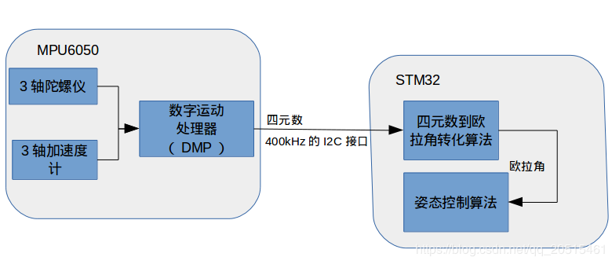
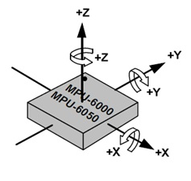
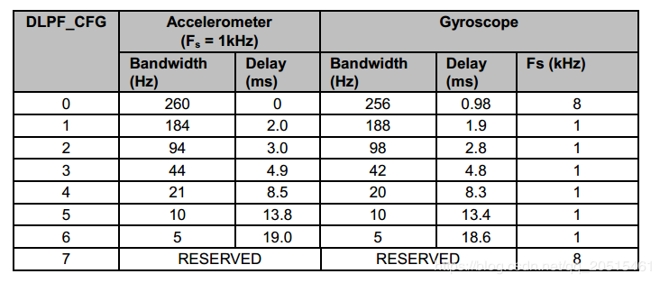
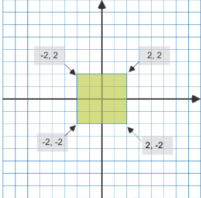
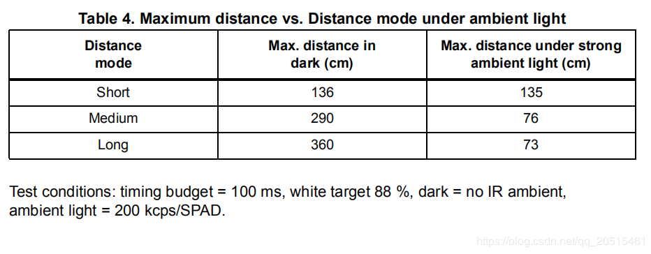
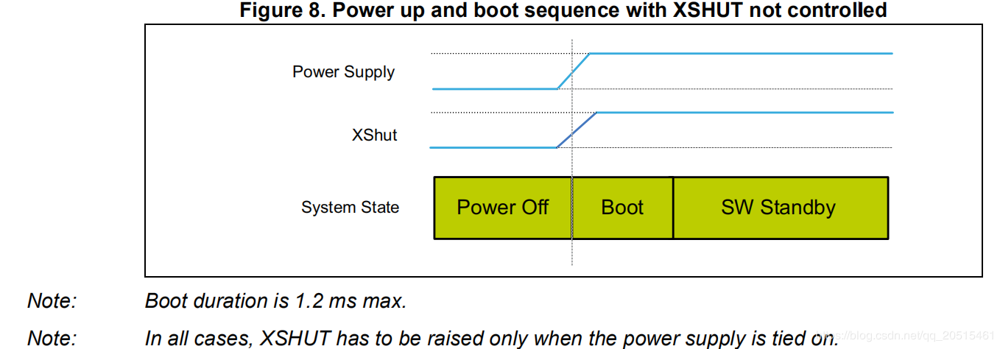
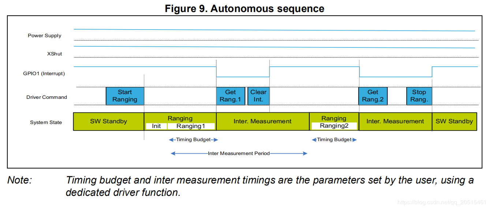
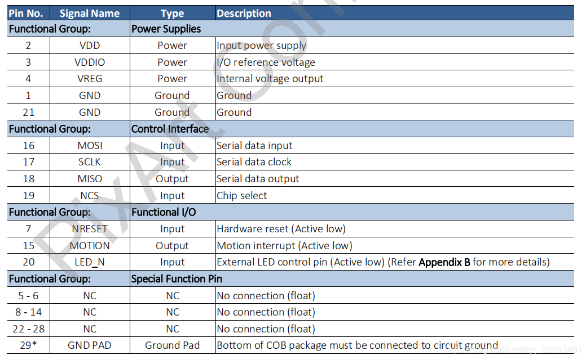

# 驱动程序

## general

* ADC

* Buzzer

* Led

* Motors

* [Wi-Fi](./communication.md)

## i2c_devices

### MPU6050

#### MPU6050 传感器特性

**工作原理**

* 陀螺仪：当陀螺仪围绕任何感应轴旋转时，科里奥利效应就会产生电容式传感器检测到的振动。所得到的信号被放大，解调和滤波产生与角速度成比例的电压。
* 电子加速度计：加速沿着一条特定轴在相应的检测质量上引起位移，引起电容式传感器检测电容的变化。

**测量范围**

* 可配置陀螺仪测量范围： ±250, ±500, ±1000, ±2000°/sec
* 可配置加速度计测量范围： ±2g, ±4g, ±8g，±16g

**AUX I2C 接口**

* MPU-60X0 具有一个辅助 I2C 总线，用于与片外3轴数字磁力计或其他传感器进行通信。
* 辅助 I2C 接口有两种工作模式：I2C Master Mode 或 Pass-Through Mode。

**MPU-60X0 FIFO**

* MPU-60X0 包含一个可通过串行接口访问的 1024 字节 FIFO 寄存器。 FIFO配置寄存器决定哪个数据写入FIFO。 可能的选择包括陀螺仪数据，加速计数据，温度读数，辅助传感器读数和 FSYNC 输入。

**数字低通滤波器（DLPF）**

* MPU6050自带低通滤波器，可以通过配置寄存器26控制低通滤波频段，减少高频干扰。但是会降低传感器输入速率（开启DLPF加速度计输出1kHZ，关闭DLPF可以输出8Khz）

**FSYNC帧同步采样引脚**

* 寄存器 26-EXT\_SYNC\_SET，用于配置外部帧同步引脚的采样

**数字运动处理器（DMP）**

* MPU6050 内部存在一个数字运动处理单元（Digital Motion Processor，DMP），可以计算四元数等，减轻主 CPU 压力。
* DMP 可以通过引脚触发中断。

   

**MPU6050方向定义**



#### MPU6050 初始化步骤

1. 恢复寄存器默认值：设置 PWR\_MGMT\_1 bit7 为 1 ，恢复后 bit7 为 0 ，bit6 自动设置为 1，进入 sleep 模式
2. 设置 PWR\_MGMT\_1 bit6 为0，唤醒传感器
3. 设置时钟源
4. 设置量程：分别设置陀螺仪和加速度计量程
5. 设置采样率
6. 设置数字低通滤波器（可选）
17
#### MPU6050 关键寄存器

**寄存器典型值**

| 寄存器 | 典型值 | 功能 |
| :---: | :---: | :---: |
| PWR\_MGMT\_1 | 0x00 | 正常启用 |
| SMPLRT\_DIV | 0x07 | 陀螺仪采样率 125Hz |
| CONFIG | 0x06 | 低通滤波器频率为 5Hz |
| GYRO\_CONFIG | 0x18 | 陀螺仪不自检，输出满量程范围为 ± 2000 °/s |
| ACCEL\_CONFIG | 0x01 | 加速度计不自检，输出的满量程范围为± 2g |

**寄存器117-设备地址-WHO\_AM\_I**

* \[6:1\] 保存设备地址，默认为 0x68，不反应 AD0 引脚值。


**寄存器107-电源管理1-PWR\_MGMT\_1**


* DEVICE\_RESET：设置为 1 时，寄存器值设置为默认。 
* SLEEP: 当该位置 1 时，该位将 MPU-60X0 置于睡眠模式。
* CYCLE：当该位设置为 1 且 SLEEP 被禁止时，MPU-60X0 将循环在睡眠模式和唤醒之间以 LP\_WAKE\_CTRL（寄存器108）确定的速率从活动传感器获取单个样本数据。

**寄存器26-配置数字低通滤波器 -CONFIG**


* 数字低通滤波器（DLPF）取值与滤波频段关系:



**寄存器27 - 陀螺仪量程配置-GYRO\_CONFIG**


* XG\_ST: X轴陀螺仪自检
* FS\_SEL：用于配置陀螺仪量程：


**寄存器28 - 加速度计量程配置-ACCEL\_CONFIG**


**寄存器25 - 采样速率分频器-SMPRT\_DIV**

该寄存器指定用于产生MPU-60X0采样率的陀螺仪输出速率的分频器。传感器寄存器输出，FIFO输出和DMP采样都基于采样率。采样率是通过将陀螺仪输出速率除以 SMPLRT\_DIV 产生的。


> Sample Rate = Gyroscope Output Rate / \(1 + SMPLRT\_DIV\) where Gyroscope Output Rate = 8kHz when the DLPF is disabled \(DLPF\_CFG = 0 or 7\), and 1kHz when the DLPF is enabled \(see Register 26\)

* 在不开启DLPF的情况下，设置 SMPLRT\_DIV 为 7 可以时芯片产生 1khz 的中断信号。


**寄存器59到64-加速度计测量值**


* 大数端存放：地址地位存放数据高位，地址高位存放数据地位。 
* 补码存放：因为测量值为有符号整数，因此采用补码方式存放

**寄存器65和66 - 温度测量**


**寄存器67至72 - 陀螺仪测量值**


### VL53LX


#### VL53LXX 传感器特性

**工作原理**

VL53L0X / VL53L1X 芯片内部集成了激光发射器和 SPAD 红外接收器，通过探测光子发送和接收时间差，计算光子飞行距离，最远测量距离可达两米，适合中短距离测量的应用。


 
**测量区域 - ROI**

VL53L0X / VL53L1X 的测量值为测量区域中的最短距离，测量区域可以根据使用场景进行放大或收缩，较大的探测范围可能会引起测量值的波动。

> 测量区域的配置参见 2.4 ranging description 2.8 Sensing array optical center



**测量距离**

* VL53L0X 传感器存在 **3-4 cm 的盲区**，有效测量范围 3cm-200cm，精度 +-3%
* VL53L1X 是 VL53L0X 的升级版本，探测距离可达 400 cm


* VL53LXX 测量距离与光线环境有关，黑暗环境下可获得更高的探测距离，在室外强光下，激光传感器可能会受到很大的干扰，导致测量精度降低，因此室外需要结合气压定高。



**测量频率**

* VL53L0X 响应频率最快可达 50 Hz，测量误差+-5%
* VL53L1X I2C 最大时钟频率可达 400khz，上拉电阻需要根据电压和总线电容值选择，可以参见vl53l1x datasheet


* XSHUT 为输入引脚，用于模式选择（休眠），需要上拉电阻放置漏电流
* GPIO1 为中断输出引脚，用于输出测量 dataready 中断

**工作模式**

通过设置 XSHUT 引脚的电平，可以切换传感器进入 HW Standby 模式或 SW Standby 模式，实现有条件的启动，降低待机功耗。如果主机放弃对传感器模式进行管理，可将 XSHUT 引脚默认为上拉。

* HW Standby ：XSHUT拉低时，传感器电源被关闭
* SW Standby ：XSHUT拉高，进入boot和SW Standby 模式




#### VL53LXX 初始化步骤

1. 等待硬件初始化完成
2. 数据初始化
3. 静态初始化，装载数据
4. 设置测量距离模式
5. 设置单次测量最长等待时间
6. 设置测量频率（时间间隔）
7. 设置测量区域 ROI（可选）
8. 启动测量

```text
/*init  vl53l1 module*/
void vl53l1_init()
{

    Roi0.TopLeftX = 0;    //测量目标区 可选最小4*4，最大16*16
    Roi0.TopLeftY = 15;
    Roi0.BotRightX = 7;
    Roi0.BotRightY = 0;
    Roi1.TopLeftX = 8;
    Roi1.TopLeftY = 15;
    Roi1.BotRightX = 15;
    Roi1.BotRightY = 0;

    int status = VL53L1_WaitDeviceBooted(Dev); //等待硬件初始化完成
    status = VL53L1_DataInit(Dev); //数据初始化，上电后立刻执行
    status = VL53L1_StaticInit(Dev); //静态初始化，装载参数
    status = VL53L1_SetDistanceMode(Dev, VL53L1_DISTANCEMODE_LONG);//设置测量模式
    status = VL53L1_SetMeasurementTimingBudgetMicroSeconds(Dev, 50000); //设置最长时间，根据测量模式确定
    status = VL53L1_SetInterMeasurementPeriodMilliSeconds(Dev, 100); //测量间隔

    status = VL53L1_SetUserROI(Dev, &Roi0); //设置ROI
    status = VL53L1_StartMeasurement(Dev); //启动测量
    if(status) {
        printf("VL53L1_StartMeasurement failed \n");
        while(1);
    }    

}
```

* 以上初始化步骤除 VL53L1\_SetUserROI，其余不可少

#### VL53LXX 测距步骤

**轮寻测量模式**

轮训测量流程图：


* 注意在完成一次测量和读取后，需要使用`VL53L1_ClearInterruptAndStartMeasurement`清除中断标志并重新开始。
* 轮训测量有两种方法，如上图所示，一种是阻塞方式（drivers polling mode），一种是非阻塞方式（Host polling mode），以下代码为阻塞测量方式。

```text
/* Autonomous ranging loop*/
static void
AutonomousLowPowerRangingTest(void)
{
    printf("Autonomous Ranging Test\n");

    static VL53L1_RangingMeasurementData_t RangingData;
    VL53L1_UserRoi_t Roi1;
    int roi = 0;
    float left = 0, right = 0;
    if (0/*isInterrupt*/) {
    } else {
        do // polling mode
            {
                int status = VL53L1_WaitMeasurementDataReady(Dev); //等待测量结果
                if(!status) {
                    status = VL53L1_GetRangingMeasurementData(Dev, &RangingData); //获取单次测量数据
                    if(status==0) {
                        if (roi & 1) {
                            left = RangingData.RangeMilliMeter;
                            printf("L %3.1f R %3.1f\n", right/10.0, left/10.0);
                        } else
                            right = RangingData.RangeMilliMeter;
                    }
                    if (++roi & 1) {
                        status = VL53L1_SetUserROI(Dev, &Roi1);
                    } else {
                        status = VL53L1_SetUserROI(Dev, &Roi0);
                    }
                    status = VL53L1_ClearInterruptAndStartMeasurement(Dev); //释放中断
                }
            }
        while (1);
    }
    //  return status;
}
```

**中断测量模式**

中断测量模式需要使用中断引脚 GPIO1，在数据 ready 时，GPIO1 引脚电平将被拉低，通知主机进行数据读取。



#### VL53LXX 传感器校准

如果在传感器接收器上方添加了光罩，或者传感器藏在透明的盖板背后，由于透光率的变化，需要对传感器进行校准，可以根据校准流程调用 API 编写校准程序，也可以使用官方提供的 GUI 上位机直接测量出校准值。

**使用官方 API 编写校准程序**

校准流程：调用顺序要完全一致。


```
/*Calibration  vl53l1 module*/
static VL53L1_CalibrationData_t vl53l1_calibration(VL53L1_Dev_t *dev)
{
    int status;
    int32_t targetDistanceMilliMeter = 703;
    VL53L1_CalibrationData_t calibrationData;
    status = VL53L1_WaitDeviceBooted(dev);
    status = VL53L1_DataInit(dev);                                       //performs the device initialization
    status = VL53L1_StaticInit(dev);                                     // load device settings specific for a given use case.
    status = VL53L1_SetPresetMode(dev,VL53L1_PRESETMODE_AUTONOMOUS);
    status = VL53L1_PerformRefSpadManagement(dev);
    status = VL53L1_PerformOffsetCalibration(dev,targetDistanceMilliMeter);
    status = VL53L1_PerformSingleTargetXTalkCalibration(dev,targetDistanceMilliMeter);
    status = VL53L1_GetCalibrationData(dev,&calibrationData);

    if (status)
    {
        ESP_LOGE(TAG, "vl53l1_calibration failed \n");
        calibrationData.struct_version = 0;
        return calibrationData;

    }else
    {
        ESP_LOGI(TAG, "vl53l1_calibration done ! version = %u \n",calibrationData.struct_version);
        return calibrationData;
    }

}
```

**使用官方 GUI 上位机校准传感器**

官方提供了用于配置和校准传感器的 GUI 上位机，配合 ST 官方 `STM32F401RE nucleo` 开发板连接传感器，使用软件校准得到基准值后，初始化时填入的即可。

>

>[STSW-IMG008:Windows Graphical User Interface \(GUI\) for VL53L1X Nucleo packs. Works with P-NUCLEO-53L1A1 ](https://www.st.com/content/st_com/en/products/embedded-software/proximity-sensors-software/stsw-img008.html)

#### VL53L1x 例程

**例程说明**

1. 实现功能：通过VL53L1x 检测到高度变化（持续一秒），红灯亮起。高度恢复正常值（持续一秒），绿灯亮起。
2. 可配置参数：通过make menuconfig 设置I2C 号码、端口号、LED端口号
3. 例程解析见代码注释与用户手册

**注意事项**

4. 该例程只适用于VL53L1x，寄送的传感器为该型号。VL53L0x为老版本硬件，不适用本例程。
5. 官方标称400cm测量距离，为黑暗环境下测得。室内正常灯光环境，可以保证10cm-260cm范围的有效测量
6. 初始化函数vl53l1\_init（VL53L1\_Dev\_t \*） 中部分参数，需要根据实际使用环境确定，还有优化的空间。
7. 传感器安装位置应确保在检测位置正上方
8. 模块上电时自动矫正基准高度，如果基准高度有变化，需要重新上电重置参数

**例程仓库**

[esp32-vl53l1x-test](https://github.com/qljz1993/esp32-vl53l1x-test/tree/master) 或者：

```text
git clone https://github.com/qljz1993/esp32-vl53l1x-test.git
```

### MS5611

### HMC5883L

### EEPROM

## spi_devices

### PMW3901

#### PMW3901传感器特性

PMW3901 是 PixArt 公司最新的高精度低功耗光学追踪模组，可直接获取 xy 方向运动速度信息，对地高度 8cm 以上实现有效测量 ，工作电流 < 9mA ， 工作电压 VDD(1.8~2.1VDC) VDDIO(1.8~3.6VDC)，使用 4 线 SPI 接口通信。

**主要参数** 

| Parameter | Value |
|--|--|
| Supply Voltage (V) | VDD: 1.8 – 2.1 VDDIO: 1.8 – 3.6 |
|Working Range (mm) | 80 to infinity |
| Interface |  4-Wire SPI @ 2 Mhz|
| Package Type |  28-pin COB Package with Lens Assembly:6 x 6 x 2.28 mm |

**封装和引脚图**




> 传感器工作电压较低，与3.3V的ＥＳＰ３２通信，需要ＶＤＤ和ＶＤＤＩＯ提供不同的电压

#### 上电启动流程

**Power-Up Sequence** 
Although PMW3901MB performs an internal power up self-reset, it is still recommended that the Power_Up_Reset register is written every time power is applied. The appropriate sequence is as follows: 
1. Apply power to VDDIO first and followed by VDD, with a delay of no more than 100ms in between each supply. Ensure all supplies are stable. 
2. Wait for at least 40 ms. 
3. Drive NCS high, and then low to reset the SPI port. 
4. Write 0x5A to Power_Up_Reset register (or alternatively, toggle the NRESET pin). 
5. Wait for at least 1 ms. 
6. Read from registers 0x02, 0x03, 0x04, 0x05 and 0x06 one time regardless of the motion pin state. 
7. Refer Section 8.2 Performance Optimization Registers to configure the needed registers in order to achieve optimum performance of the chip. 


**Power-Down Sequence** 
PMW3901MB can be set to Shutdown mode by writing to Shutdown register. The SPI port should not be accessed when Shutdown mode is asserted, except the power-up command (writing 0x5A to register 0x3A). Other ICs on the same SPI bus can be accessed, as long as the chip’s NCS pin is not asserted. 
To de-assert Shutdown mode: 
8. Drive NCS high, and then low to reset the SPI port. 
9. Write 0x5A to Power_Up_Reset register (or alternatively, toggle the NRESET pin). 
10. Wait for at least 1 ms. 
11. Read from registers 0x02, 0x03, 0x04, 0x05 and 0x06 one time regardless of the motion pin state. 
12. Refer Section 8.2 Performance Optimization Registers to configure the needed registers in order to achieve optimum performance of the chip.


[pixart其他产品助力IOT](https://www.pixart.com/applications/11/Connected_Home_Appliances_%EF%BC%86_IoT)

#### 部分代码解读

**关键结构体**

```

typedef struct opFlow_s 
{
	float pixSum[2]; /*累积像素*/
	float pixComp[2]; /*像素补偿*/
	float pixValid[2]; /*有效像素*/
	float pixValidLast[2]; /*上一次有效像素*/
	float deltaPos[2]; /*2 帧之间的位移 单位 cm*/
	float deltaVel[2]; /*速度 单位 cm/s*/
	float posSum[2]; /*累积位移 单位 cm*/
	float velLpf[2]; /*速度低通 单位 cm/s*/
	bool isOpFlowOk; /*光流状态*/
	bool isDataValid; /*数据有效*/
} opFlow_t;

```

* 累积像素，就是自四轴起飞后的累积像素；
* 像素补偿，就是补偿由于飞机倾斜导致的像素误差；
* 有效像素，指经过补偿的实际像素；
* 2 帧之间的位移，这个就是由像素转换出来的实际位移，单位 cm；
* 速度，这个速度是瞬时速度，由位移变化量微分得到，单位 cm/s；
* 累积位移，实际位移，单位 cm速度低通，对速度进行低通，增加数据平滑性；
* 光流状态，光流是否正常工作；
* 数据有效，在一定高度范围内，数据有效；

```
typedef struct motionBurst_s {
  union {
    uint8_t motion;
    struct {
      uint8_t frameFrom0    : 1;
      uint8_t runMode       : 2;
      uint8_t reserved1     : 1;
      uint8_t rawFrom0      : 1;
      uint8_t reserved2     : 2;
      uint8_t motionOccured : 1;
    };
  };

  uint8_t observation;
  int16_t deltaX;
  int16_t deltaY;

  uint8_t squal;

  uint8_t rawDataSum;
  uint8_t maxRawData;
  uint8_t minRawData;

  uint16_t shutter;
} __attribute__((packed)) motionBurst_t;
```

* motion ：运动信息，可以根据不同的位去判断运动信息，包括帧判别，运行模式和运动信息检测等。
* observation：这个是用于检测 IC 是否出现 EFT/B 或者 ESD 问题，传感器正常工作时，读取出来的值为0xBF。
* deltaX, deltaY ：光流检测到图像的 X 和 Y 方向的运动信息。
* squal ：指运动信息质量，简单说就是运动信息的可信度。
* rawDataSum ：这个是原数据求和，可用作对一帧数据求平均值；maxRawData 和 minRawData ，是最大和最小原始数据；
* shutter：是一个实时自动调整的值，目的是保证平均运动数据在正常可操作范围以内，这个值可以搭配 squal，用来判断运动信息是否可用。

#### 编程注意事项

1. 如果连续 1s 内光流数据都为 0，说明出现故障，需要做挂起光流任务等处理。
2. 可以设置pitch为x，roll方向为y，需要注意因为传感器向下安装，且地面不动，**飞机向前走，图像是向后的。**
3. 需要测量准确的高度，同于确定图像像素和实际距离的对应关系，这个高度会作为一个计算的参数（因此只有在定高模式稳定才能定点）光流手册 42 页计算关系。

```
补充计算关系与代码实现
```

4. 需要手动测试倾角补偿，效果是，能够通过补偿，使飞行器有一定的倾角时，传感器输出基本不变化

```
补充测试过程
```

5. 有了倾角补偿和运动累积像素，我们就可以得到实际累积像素，减去上次的实际像素，就可以得到 2 帧之间的变化像素，再乘以系数就可以得到 2 帧之间的位移变化，可以看到还有对系数的限制，当高度小于 5cm，光流就无法工作了，所以系数设置为 0。接着对这个位移积分得到四轴到起飞点的位移，对这个位移微分得到瞬时速度，对速度进行低通增加数据的平滑性，对速度进行限幅处理，增加数据安全性。
6. 通过光流就得到了四轴的位置信息和速度信息，把这些位置信息和速度信息融合加速计（state_estimator.c），得到估测位置和速度，将估测位置和速度参与 PID 运算，即可用于水平方向位置控制，这部分内容请看 position_pid.c，源码里面可以直接看到位置环和速度环 PID 的处理过程，这样就可以实现水平定点控制了。
