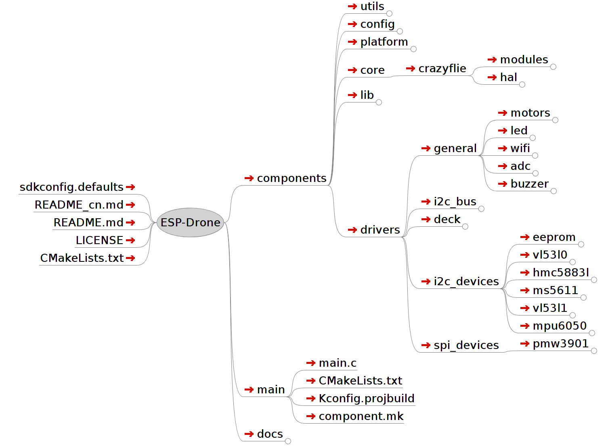

# 搭建开发环境

## ESP-IDF 环境搭建

请参照ESP-IDF 入门指南： [https://docs.espressif.com/projects/esp-idf/en/latest/esp32s2/get-started/index.html](https://docs.espressif.com/projects/esp-idf/en/latest/esp32s2/get-started/index.html)，按照步骤设置 ESP-IDF。

注意事项：
* 请完成链接页面的所有步骤。
* 请按照上面链接中的步骤构建一个或多个示例应用程序。

## ESP32(S2) 链接脚本修改

打开 ESP32(S2) 的链接脚本模板`${IDF_PATH}/components/esp32/ld/esp32.project.ld.in` 和 ` ${IDF_PATH}/components/esp32s2/ld/esp32s2.project.ld.in`, 将以下代码添加到 `.flash.rodata` 段的末尾.

```
   /* Parameters and log system datas */
    _param_start = .;
    KEEP(*(.param))
    KEEP(*(.param.*))
    _param_stop = .;
    . = ALIGN(4);
    _log_start = .;
    KEEP(*(.log))
    KEEP(*(.log.*))
    _log_stop = .;
    . = ALIGN(4);
```

以上代码可以实现，将具有 `.param.*` 或 `.log.*` 段属性的变量，放置在连续的存储区域，从而加快变量遍历速度。

## 获取项目源代码

**测试版本代码，目前放在 gitlab 仓库，使用 git 工具获取**

```
git clone https://github.com/espressif/esp-drone.git
```

**项目软件主要由飞控内核、硬件驱动和依赖库组成**

* 飞控内核来自 crazyflie 开源工程，主要包括硬件抽象层和飞控程序
* 硬件驱动按照硬件接口进行了文件结构划分，包括 I2C 设备和 SPI 设备等
* 依赖库包括 ESP-IDF 提供的默认组件，以及来自第三方的 DSP 等

**代码文件结构如下所示：**



```
.
├── components                        | 项目组件目录
│   ├── config                              | 系统 task 配置
│   │   └── include
│   ├── core                                 | 系统内核目录
│   │   └── crazyflie                  | crazyflie 内核
│   │       ├── hal                         | 硬件抽象代码 
│   │       └── modules             |  飞行控制代码 
│   ├── drivers                            | 硬件驱动目录
│   │   ├── deck                         | 硬件扩展接口驱动
│   │   ├── general                    | 一般设备目录
│   │   │   ├── adc                     | ADC 驱动，用于电压监测
│   │   │   ├── buzzer              | 蜂鸣器驱动，用于状态反馈
│   │   │   ├── led                     | LED驱动，用于状态反馈
│   │   │   ├── motors             | 电机驱动，用于推力输出
│   │   │   └── wifi                    | Wi-Fi 驱动，用于通信
│   │   ├── i2c_bus                   | I2C 驱动
│   │   ├── i2c_devices           | I2C 设备目录
│   │   │   ├── eeprom           | eeprom驱动，用于参数存储
│   │   │   ├── hmc5883l         | hmc5883l 磁罗盘传感器
│   │   │   ├── mpu6050          | mpu6050 陀螺仪加速度计传感器
│   │   │   ├── ms5611             | ms5611 气压传感器
│   │   │   ├── vl53l0                 | Ivl53l0 2m 激光传感器
│   │   │   └── vl53l1                 |  Ivl53l1 4m 激光传感器
│   │   └── spi_devices           | SPI 设备目录
│   │       └── pmw3901           | pmw3901 光流传感器
│   ├── lib                                      | 外部库目录
│   │   └── dsp_lib                    | dsp 库
│   ├── platform                         | 用于支持多平台
│   └── utils                                  | 工具函数目录
├── CMakeLists.txt                    | 工具函数
├── LICENSE                                | 开源协议
├── main                                       | 入口函数
├── README.md                        | 项目说明
└── sdkconfig.defaults            | 默认参数
```

**详情可查阅**：[espdrone_file_structure](./_static/espdrone_file_structure.pdf)

## 源代码风格

**两种方式检索同一区域（union）**

以下可以实现两种检索方式检索同一片内存区域，可以使用

```text
 typedef union {
   struct {
         float x;
         float y;
         float z;
   };
   float axis[3];
 } Axis3f;
```

**使用枚举类型计数**

以下枚举类型成员SensorImplementation\_COUNT，始终可以代表枚举类型中成员的个数。巧妙利用了枚举类型第一个成员默认为0的特点

```text
typedef enum {  
  #ifdef SENSOR_INCLUDED_BMI088_BMP388
  SensorImplementation_bmi088_bmp388,
  #endif

  #ifdef SENSOR_INCLUDED_BMI088_SPI_BMP388
  SensorImplementation_bmi088_spi_bmp388,
  #endif

  #ifdef SENSOR_INCLUDED_MPU9250_LPS25H
  SensorImplementation_mpu9250_lps25h,
  #endif

  #ifdef SENSOR_INCLUDED_MPU6050_HMC5883L_MS5611
  SensorImplementation_mpu6050_HMC5883L_MS5611,
  #endif

  #ifdef SENSOR_INCLUDED_BOSCH
  SensorImplementation_bosch,
  #endif

  SensorImplementation_COUNT,
} SensorImplementation_t;
```

**紧凑的数据类型**

```text
struct cppmEmuPacket_s {
  struct {
      uint8_t numAuxChannels : 4;   // Set to 0 through MAX_AUX_RC_CHANNELS
      uint8_t reserved : 4;
  } hdr;
  uint16_t channelRoll;
  uint16_t channelPitch;
  uint16_t channelYaw;
  uint16_t channelThrust;
  uint16_t channelAux[MAX_AUX_RC_CHANNELS];
} __attribute__((packed));
```

**attribute** \(\(packed\)\) 的作用是告诉编译器取消结构在编译过程中的优化对齐,按照实际占用字节数进行对齐，是 GCC 特有的语法。这个功能是跟操作系统没关系，跟编译器有关，gcc 编译器不是紧凑模式的，在 windows 下，用 vc 的编译器也不是紧凑的，用tc 的编译器就是紧凑的。例如：

```text
在TC下：struct my{ char ch; int a;} sizeof(int)=2;sizeof(my)=3;（紧凑模式）
在GCC下：struct my{ char ch; int a;} sizeof(int)=4;sizeof(my)=8;（非紧凑模式）
在GCC下：struct my{ char ch; int a;}__attrubte__ ((packed)) sizeof(int)=4;sizeof(my)=5
```