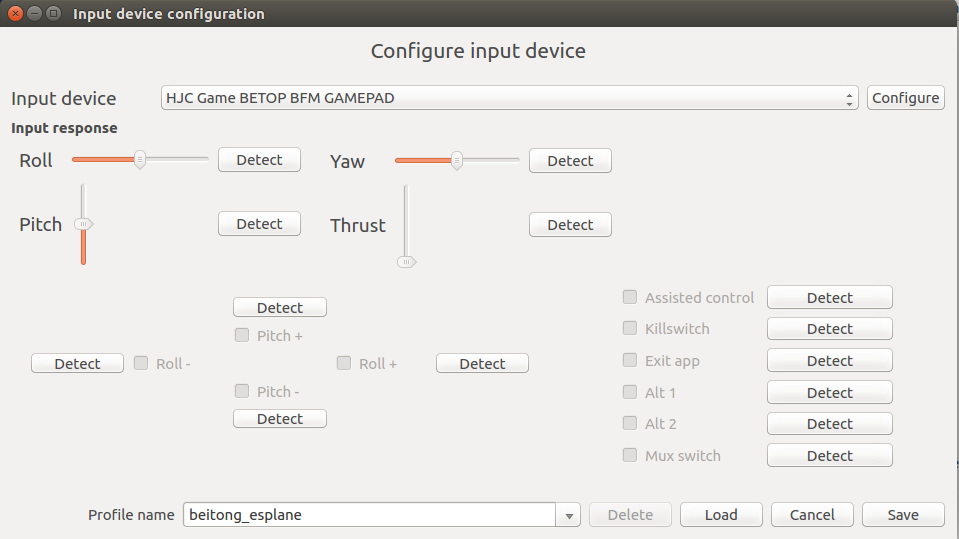
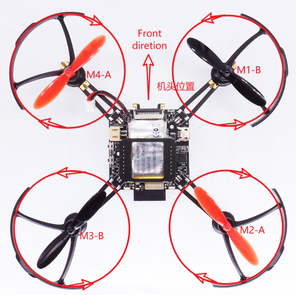

# 快速入门

## 项目简介

ESP-Drone 是基于乐鑫 ESP32/ESP32-S2 开发的小型无人机解决方案，可使用手机 APP 或游戏手柄通过 Wi-Fi 网络进行连接和控制，目前已支持自稳定飞行、定高飞行、定点飞行等多种模式。该方案硬件结构简单，代码架构清晰，支持功能扩展，可用于 STEAM 教育等领域。项目部分代码来自 Crazyflie 开源工程，继承 GPL3.0 开源协议。


* 支持自稳定模式-stabilize：自动控制机身水平，保持平稳飞行
* 支持定高模式-heighthold：自动控制油门输出，保持固定高度
* 支持定点模式-positionhold：自动控制机身角度，保持固定空间位置
* 支持 PC 上位机调试：使用 cfclient 上位机进行静态/动态调试
* 支持 APP 控制：使用手机 APP 通过 Wi-Fi 轻松控制
* 支持游戏手柄控制-gamepad：通过 cfclient 使用游戏手柄轻松控制

**ESP-Drone 2.0 使用模块化的设计思路，由主控板和扩展板组成：**

* **主控制板**：搭载支持基础飞行的必要元器件，提供硬件扩展接口
* **扩展板**：基于硬件扩展接口，用于支持高级飞行功能或其他 DIY 功能

|序号| 模块名 | 主要元器件 | 功能 | 接口 |安装位置 |
|--|--|--|--|--|--|
|1| **主控制板-ESP32-S2** |  ESP32-S2-WROVER + MPU6050| 基础飞行 |提供 I2C SPI GPIO 扩展接口  ||
|2|扩展板- **定点模块** |  PMW3901 + VL53L1X | 室内定点飞行 | SPI + I2C | 底部，面向地面 |
|3| 扩展板-**气压定高模块** |  MS5611 气压 | 气压定高 | I2C 或 MPU6050从机|顶部或底部 |
|4| 扩展板-指南针模块 |  HMC5883 罗盘 | 无头模式等高级模式 | I2C 或 MPU6050从机|顶部或底部 |

详情可查阅：[hardware](./hardware.md)

## ESP-IDF 简介

ESP-IDF 是乐鑫为 ESP32/ESP32-S2 提供的物联网开发框架。

* ESP-IDF 包含一系列库及头文件，提供了基于 ESP32/ESP32-S2 构建软件项目所需的核心组件。
* ESP-IDF 还提供了开发和量产过程中最常用的工具及功能，例如：构建、烧录、调试和测量等。

详情可查阅：[ESP-IDF Get Started](https://docs.espressif.com/projects/esp-idf/en/latest/esp32s2/get-started/index.html)

## Crazyflie 简介

Crazyflie 是来自 bitcraze 开源工程的四旋翼飞行器。

* Crazyflie 支持多种传感器组合，可以轻松实现定高模式、定点模式等高级飞行模式。
* Crazyflie 基于 FreeRTOS 编写，将复杂的无人机系统，分解成多个具有不同优先级的软件任务。
* Crazyflie 设计了功能完备的 cfclient 上位机和 CRTP 通信协议，便于实现调试、测量和控制。


>图片来源：A swarm of drones exploring the environment, avoiding obstacles and each other. \(Guus Schoonewille, TU Delft\)

详情可查阅 crazyflie 官网：https://www.bitcraze.io/

## 准备工作

### 硬件组装

ESP-Drone_S2_V1.2：


详细的硬件介绍和引脚资源分配可查阅：[hardware](./hardware.md)

### 安装 ESPDroe APP

**Android APP 下载：**

[https://github.com/qljz1993/DailyMD_public/raw/master/esplanes2_test/ESP-Drone-android-debug.apk](https://github.com/qljz1993/DailyMD_public/raw/master/esplanes2_test/ESP-Drone-android-debug.apk)

**IOS APP 扫码下载：**


### 安装 CFClient

> 安装 CFClient 为可选步骤，用于实现高级调试，非必须使用


**1.安装crtp协议支持包**

1.1 下载源代码 

```text
git clone -b dev_esplane  https://github.com/qljz1993/crazyflie-lib-python.git
```

1.2 进入源码目录，安装依赖 

```text
pip3 install -r requirements.txt
```

1.3 安装crtp包 

```text
pip3 install -e .
```

**2.安装cfclient**

2.1 下载源代码

```text
git clone -b dev_esplane https://github.com/qljz1993/crazyflie-clients-python.git
```

2.2  进入源码目录，安装依赖 

```text
sudo apt-get install python3 python3-pip python3-pyqt5 python3-pyqt5.qtsvg
```

2.3  安装cfclient客户端

```text
pip3 install -e .
```

2.4 启动客户端


```text
python3 ./bin/cfclient
```

**3.配置遥控器**



3.1 配置4个控制轴 `Roll 、Pitch、Yaw、Thrust`

3.2 配置一个按键为`Assisted control` ，用于飞行模式切换

## 手机 APP 使用指引

１. WiFi 连接

    SSID：ESPDRONE_XXXX (XXXX根据 MAC 设置） PASSWORD：12345678

２. 个性化设置

	```
	默认配置：

	Flight control settings 
		1. Mode: Mode2
		2. Deadzone: 0.2
		3. Roll trim: 0.0
		4. Pitch trim: 0.0
		5. Advanced flight control : true
		6. Advanced flight control preferences 
			1. max roll/pitch angle: 15
			2. max yaw angle: 90
			3. max thrust: 90
			4. min thrust: 25
			5. X-Mode: true
	Controller settings 
		1. use full travel for thrust: false
		2. virtual joystick size: 100
	App settings
		1. Screen rotation lock: true
		2. full screen mode:true
		3. show console: true   
	```

３. 控制飞行
  1. 打开通信连接，小飞机绿灯将闪烁
  2. 轻推油门，起飞

	


## PC CFClient 使用指引

CFclient 是 `crazeflie` 源工程的上位机，完全实现了 `CRTP` 协议中定义的功能，可以加快飞机的调试过程，ESP-Drone 项目对该上位机进行裁剪和调整，满足功能设计需求。


项目中有很多相关的文件，例如配置文件和缓存文件，其中JSON文件用来存储配置信息。关于配置信息中内容的解读：[User configuration file](https://www.bitcraze.io/docs/crazyflie-clients-python/master/dev_info_client/)

### 飞行设置

**基本飞行设置 Basic Flight Control**

1. 飞行模式 Flight mode selector \(Normal and Advanced\)
   * 基本模式 _Normal: 初学者使用
   * 高级模式 _Advanced: 设置解锁最大角度，设置最大油门。
2. 自动模式 Assisted mode selection. 
   * 定海拔模式 _Altitude hold_: 保持飞行海拔，需要气压计支持。
   * 定点模式 _Position hold_: 保持当前位置，需要光流和TOF支持。 
   * 定高模式 _Height hold_: 保持相对高度, 触发时保持高于地面 40cm ，需要TOF支持。
   * 悬停模式 _Hover : 触发时保持高于地面 40cm，并悬停在起飞点，需要光流和TOF支持。
3. 角度修正 trim
	* Roll Trim : 翻滚角修正，用于弥补传感器水平安装误差
	* Pitch Trim : 俯仰角修正，用于弥补传感器水平安装误差

> 在自动模式下，油门摇杆变为高度控制摇杆

**高级飞行设置 Advanced Flight Control**

1.  最大倾角 _Max angle: 设置最大允许的俯仰和翻滚角度 roll/pitch
2. 最大自选速度 _Max yaw rate: 设置允许的偏航速度  yaw 
3. 最大油门 _Max thrust: 设置最大油门
4. 最小油门 _Min thrust: 设置最小油门
5. 回转极限 _Slew limit:  回转极限。防止油门骤降，油门低于该值时，将被平滑的接管。 Set the percentage where the thrust is slew controlled \(the thrust value lowering will be limited\). This makes the Crazyflie a bit easier to fly for beginners
6. 回转率 _Slew rate: 油门到回转极限时，最大的油门值。When the thrust is below the slew limit, this is the maximum rate of lowering the thrust

**遥控器设置 Configure input device**

按照提示绑定遥控器摇杆与各个控制通道：


**飞行数据 Fligt Data**

驾驶仪可以看到当前飞机姿态，右下方显示对应的详细数据。
1. 目标角度 Target
2. 测量角度 Actual
3. 当前油门值 Thrust
4. 电机实际输出 M1\M2\M3\M4

### 在线参数修改

**注意事项**

1. 修改的参数实时生效，避免了频繁烧录固件。
2. 可在代码中通过宏定义配置那些参数可被上位机实时修改。
3. 注意参数在线修改仅用于调试，掉电不保存。

**在线调整 PID 参数**


### 飞行数据监控

**配置要监控的参数**


**实时波形绘制**

陀螺仪加速度计实时数据监测：


## 螺旋桨方向

* 注意按照下图所示位置，安装 A B 螺旋桨
* 注意检查飞机上电自检时，螺旋桨转向是否正确？



## 起飞前检查

* 将飞机头部朝前放置，尾部天线朝向自己
* 注意将飞机置于水平面上，机身稳定时上电
* 注意观察上位机水平面是否置平？
* 注意观察通信建立以后，小飞机尾部绿灯是否快速闪速
* 注意观察小飞机头部红灯是否熄灭，亮起代表电量不足
* 轻推左手小油门，检查飞机是否能快速响应
* 轻推右手方向，检查方向控制是否正确
* 起飞吧！