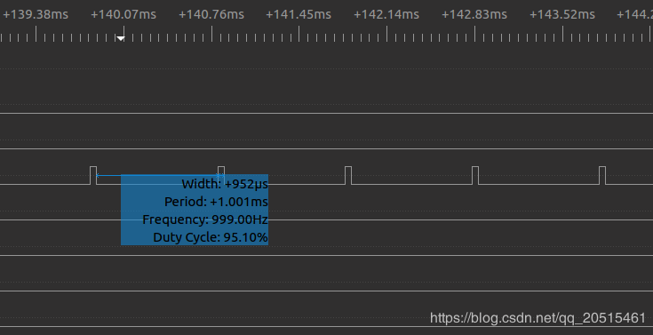

## MPU6050 传感器特性

**工作原理**

* 陀螺仪：当陀螺仪围绕任何感应轴旋转时，科里奥利效应就会产生电容式传感器检测到的振动。所得到的信号被放大，解调和滤波产生与角速度成比例的电压。
* 电子加速度计：加速沿着一条特定轴在相应的检测质量上引起位移，引起电容式传感器检测电容的变化。

**测量范围**

* 可配置陀螺仪测量范围： ±250, ±500, ±1000, ±2000°/sec
* 可配置加速度计测量范围： ±2g, ±4g, ±8g，±16g

**AUX I2C 接口**

* MPU-60X0 具有一个辅助 I2C 总线，用于与片外3轴数字磁力计或其他传感器进行通信。
* 辅助 I2C 接口有两种工作模式：I2C Master Mode 或 Pass-Through Mode。

**MPU-60X0 FIFO**

* MPU-60X0 包含一个可通过串行接口访问的 1024 字节 FIFO 寄存器。 FIFO配置寄存器决定哪个数据写入FIFO。 可能的选择包括陀螺仪数据，加速计数据，温度读数，辅助传感器读数和 FSYNC 输入。

**数字低通滤波器（DLPF）**

* MPU6050自带低通滤波器，可以通过配置寄存器26控制低通滤波频段，减少高频干扰。但是会降低传感器输入速率（开启DLPF加速度计输出1kHZ，关闭DLPF可以输出8Khz）

**FSYNC帧同步采样引脚**

* 寄存器 26-EXT\_SYNC\_SET，用于配置外部帧同步引脚的采样

**数字运动处理器（DMP）**

* MPU6050 内部存在一个数字运动处理单元（Digital Motion Processor，DMP），可以计算四元数等，减轻主 CPU 压力。
* DMP 可以通过引脚触发中断。

   

**MPU6050方向定义**

## MPU6050 初始化步骤

1. 恢复寄存器默认值：设置 PWR\_MGMT\_1 bit7 为 1 ，恢复后 bit7 为 0 ，bit6 自动设置为 1，进入 sleep 模式
2. 设置 PWR\_MGMT\_1 bit6 为0，唤醒传感器
3. 设置时钟源
4. 设置量程：分别设置陀螺仪和加速度计量程
5. 设置采样率
6. 设置数字低通滤波器（可选）
17
## MPU6050 关键寄存器

### 寄存器典型值

| 寄存器 | 典型值 | 功能 |
| :---: | :---: | :---: |
| PWR\_MGMT\_1 | 0x00 | 正常启用 |
| SMPLRT\_DIV | 0x07 | 陀螺仪采样率 125Hz |
| CONFIG | 0x06 | 低通滤波器频率为 5Hz |
| GYRO\_CONFIG | 0x18 | 陀螺仪不自检，输出满量程范围为 ± 2000 °/s |
| ACCEL\_CONFIG | 0x01 | 加速度计不自检，输出的满量程范围为± 2g |

### 寄存器117-设备地址-WHO\_AM\_I

* \[6:1\] 保存设备地址，默认为 0x68，不反应 AD0 引脚值。

### 寄存器107-电源管理1-PWR\_MGMT\_1

* DEVICE\_RESET：设置为 1 时，寄存器值设置为默认。 
* SLEEP: 当该位置 1 时，该位将 MPU-60X0 置于睡眠模式。
* CYCLE：当该位设置为 1 且 SLEEP 被禁止时，MPU-60X0 将循环在睡眠模式和唤醒之间以 LP\_WAKE\_CTRL（寄存器108）确定的速率从活动传感器获取单个样本数据。

### 寄存器26-配置数字低通滤波器 -CONFIG

* 数字低通滤波器（DLPF）取值与滤波频段关系:

### 寄存器27 - 陀螺仪量程配置-GYRO\_CONFIG

* XG\_ST: X轴陀螺仪自检
* FS\_SEL：用于配置陀螺仪量程：

### 寄存器28 - 加速度计量程配置-ACCEL\_CONFIG

### 寄存器25 - 采样速率分频器-SMPRT\_DIV

该寄存器指定用于产生MPU-60X0采样率的陀螺仪输出速率的分频器。传感器寄存器输出，FIFO输出和DMP采样都基于采样率。采样率是通过将陀螺仪输出速率除以 SMPLRT\_DIV 产生的。

> Sample Rate = Gyroscope Output Rate / \(1 + SMPLRT\_DIV\) where Gyroscope Output Rate = 8kHz when the DLPF is disabled \(DLPF\_CFG = 0 or 7\), and 1kHz when the DLPF is enabled \(see Register 26\)

* 在不开启DLPF的情况下，设置 SMPLRT\_DIV 为 7 可以时芯片产生 1khz 的中断信号。

### 寄存器59到64-加速度计测量值

* 大数端存放：地址地位存放数据高位，地址高位存放数据地位。 
* 补码存放：因为测量值为有符号整数，因此采用补码方式存放

### 寄存器65和66 - 温度测量

### 寄存器67至72 - 陀螺仪测量值

