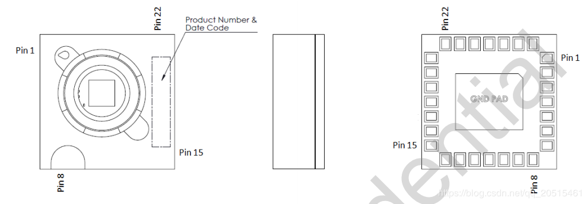

## PMW3901传感器特性

PMW3901 是 PixArt 公司最新的高精度低功耗光学追踪模组，可直接获取 xy 方向运动速度信息，对地高度 8cm 以上实现有效测量 ，工作电流 < 9mA ， 工作电压 VDD(1.8~2.1VDC) VDDIO(1.8~3.6VDC)，使用 4 线 SPI 接口通信。

**主要参数** 

| Parameter | Value |
|--|--|
| Supply Voltage (V) | VDD: 1.8 – 2.1 VDDIO: 1.8 – 3.6 |
|Working Range (mm) | 80 to infinity |
| Interface |  4-Wire SPI @ 2 Mhz|
| Package Type |  28-pin COB Package with Lens Assembly:6 x 6 x 2.28 mm |

**封装和引脚图**




> 传感器工作电压较低，与3.3V的ＥＳＰ３２通信，需要ＶＤＤ和ＶＤＤＩＯ提供不同的电压

## Power States & Sequence

**Power-Up Sequence** 
Although PMW3901MB performs an internal power up self-reset, it is still recommended that the Power_Up_Reset register is written every time power is applied. The appropriate sequence is as follows: 
1. Apply power to VDDIO first and followed by VDD, with a delay of no more than 100ms in between each supply. Ensure all supplies are stable. 
2. Wait for at least 40 ms. 
3. Drive NCS high, and then low to reset the SPI port. 
4. Write 0x5A to Power_Up_Reset register (or alternatively, toggle the NRESET pin). 
5. Wait for at least 1 ms. 
6. Read from registers 0x02, 0x03, 0x04, 0x05 and 0x06 one time regardless of the motion pin state. 
7. Refer Section 8.2 Performance Optimization Registers to configure the needed registers in order to achieve optimum performance of the chip. 


**Power-Down Sequence** 
PMW3901MB can be set to Shutdown mode by writing to Shutdown register. The SPI port should not be accessed when Shutdown mode is asserted, except the power-up command (writing 0x5A to register 0x3A). Other ICs on the same SPI bus can be accessed, as long as the chip’s NCS pin is not asserted. 
To de-assert Shutdown mode: 
8. Drive NCS high, and then low to reset the SPI port. 
9. Write 0x5A to Power_Up_Reset register (or alternatively, toggle the NRESET pin). 
10. Wait for at least 1 ms. 
11. Read from registers 0x02, 0x03, 0x04, 0x05 and 0x06 one time regardless of the motion pin state. 
12. Refer Section 8.2 Performance Optimization Registers to configure the needed registers in order to achieve optimum performance of the chip.


[pixart其他产品助力IOT](https://www.pixart.com/applications/11/Connected_Home_Appliances_%EF%BC%86_IoT)

## 与飞控程序通信

### 关键结构体

```

typedef struct opFlow_s 
{
	float pixSum[2]; /*累积像素*/
	float pixComp[2]; /*像素补偿*/
	float pixValid[2]; /*有效像素*/
	float pixValidLast[2]; /*上一次有效像素*/
	float deltaPos[2]; /*2 帧之间的位移 单位 cm*/
	float deltaVel[2]; /*速度 单位 cm/s*/
	float posSum[2]; /*累积位移 单位 cm*/
	float velLpf[2]; /*速度低通 单位 cm/s*/
	bool isOpFlowOk; /*光流状态*/
	bool isDataValid; /*数据有效*/
} opFlow_t;

```

* 累积像素，就是自四轴起飞后的累积像素；
* 像素补偿，就是补偿由于飞机倾斜导致的像素误差；
* 有效像素，指经过补偿的实际像素；
* 2 帧之间的位移，这个就是由像素转换出来的实际位移，单位 cm；
* 速度，这个速度是瞬时速度，由位移变化量微分得到，单位 cm/s；
* 累积位移，实际位移，单位 cm速度低通，对速度进行低通，增加数据平滑性；
* 光流状态，光流是否正常工作；
* 数据有效，在一定高度范围内，数据有效；

```
typedef struct motionBurst_s {
  union {
    uint8_t motion;
    struct {
      uint8_t frameFrom0    : 1;
      uint8_t runMode       : 2;
      uint8_t reserved1     : 1;
      uint8_t rawFrom0      : 1;
      uint8_t reserved2     : 2;
      uint8_t motionOccured : 1;
    };
  };

  uint8_t observation;
  int16_t deltaX;
  int16_t deltaY;

  uint8_t squal;

  uint8_t rawDataSum;
  uint8_t maxRawData;
  uint8_t minRawData;

  uint16_t shutter;
} __attribute__((packed)) motionBurst_t;
```

* motion ：运动信息，可以根据不同的位去判断运动信息，包括帧判别，运行模式和运动信息检测等。
* observation：这个是用于检测 IC 是否出现 EFT/B 或者 ESD 问题，传感器正常工作时，读取出来的值为0xBF。
* deltaX, deltaY ：光流检测到图像的 X 和 Y 方向的运动信息。
* squal ：指运动信息质量，简单说就是运动信息的可信度。
* rawDataSum ：这个是原数据求和，可用作对一帧数据求平均值；maxRawData 和 minRawData ，是最大和最小原始数据；
* shutter：是一个实时自动调整的值，目的是保证平均运动数据在正常可操作范围以内，这个值可以搭配 squal，用来判断运动信息是否可用。


### 编程注意事项

1. 如果连续 1s 内光流数据都为 0，说明出现故障，需要做挂起光流任务等处理。
2. 可以设置pitch为x，roll方向为y，需要注意因为传感器向下安装，且地面不动，**飞机向前走，图像是向后的。**
3. 需要测量准确的高度，同于确定图像像素和实际距离的对应关系，这个高度会作为一个计算的参数（因此只有在定高模式稳定才能定点）光流手册 42 页计算关系。

```
补充计算关系与代码实现
```

4. 需要手动测试倾角补偿，效果是，能够通过补偿，使飞行器有一定的倾角时，传感器输出基本不变化

```
补充测试过程
```

5. 有了倾角补偿和运动累积像素，我们就可以得到实际累积像素，减去上次的实际像素，就可以得到 2 帧之间的变化像素，再乘以系数就可以得到 2 帧之间的位移变化，可以看到还有对系数的限制，当高度小于 5cm，光流就无法工作了，所以系数设置为 0。接着对这个位移积分得到四轴到起飞点的位移，对这个位移微分得到瞬时速度，对速度进行低通增加数据的平滑性，对速度进行限幅处理，增加数据安全性。
6. 通过光流就得到了四轴的位置信息和速度信息，把这些位置信息和速度信息融合加速计（state_estimator.c），得到估测位置和速度，将估测位置和速度参与 PID 运算，即可用于水平方向位置控制，这部分内容请看 position_pid.c，源码里面可以直接看到位置环和速度环 PID 的处理过程，这样就可以实现水平定点控制了。


