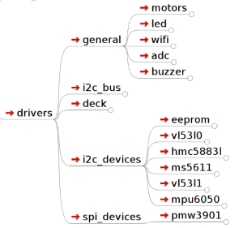

## 传感器驱动

传感器驱动代码，可以在 `components\drivers` 中查阅，`drivers` 使用了与 [esp-iot-solution](https://github.com/espressif/esp-iot-solution/)类似的文件结构，将驱动程序按照所属总线进行分类，包括 `i2c_devices` 、`spi_devices`、`general` 等。具体可参考：[drivers](./drivers)



## 传感器硬件抽象层

`components\core\crazyflie\hal\src\sensors.c` 文件对传感器进行了硬件抽象，开发者可以自由组合传感器，通过实现硬件抽象层定义的传感器接口，与上层应用进行对接。

```
typedef struct {
  SensorImplementation_t implements;
  void (*init)(void);
  bool (*test)(void);
  bool (*areCalibrated)(void);
  bool (*manufacturingTest)(void);
  void (*acquire)(sensorData_t *sensors, const uint32_t tick);
  void (*waitDataReady)(void);
  bool (*readGyro)(Axis3f *gyro);
  bool (*readAcc)(Axis3f *acc);
  bool (*readMag)(Axis3f *mag);
  bool (*readBaro)(baro_t *baro);
  void (*setAccMode)(accModes accMode);
  void (*dataAvailableCallback)(void);
} sensorsImplementation_t;
```

esp-drone 实现的传感器抽象接口在 `components/core/crazyflie/hal/src/sensors_mpu6050_hm5883L_ms5611.c` 中，通过以下赋值过程与上层应用对接：

```
#ifdef SENSOR_INCLUDED_MPU6050_HMC5883L_MS5611
  {
    .implements = SensorImplementation_mpu6050_HMC5883L_MS5611,
    .init = sensorsMpu6050Hmc5883lMs5611Init,
    .test = sensorsMpu6050Hmc5883lMs5611Test,
    .areCalibrated = sensorsMpu6050Hmc5883lMs5611AreCalibrated,
    .manufacturingTest = sensorsMpu6050Hmc5883lMs5611ManufacturingTest,
    .acquire = sensorsMpu6050Hmc5883lMs5611Acquire,
    .waitDataReady = sensorsMpu6050Hmc5883lMs5611WaitDataReady,
    .readGyro = sensorsMpu6050Hmc5883lMs5611ReadGyro,
    .readAcc = sensorsMpu6050Hmc5883lMs5611ReadAcc,
    .readMag = sensorsMpu6050Hmc5883lMs5611ReadMag,
    .readBaro = sensorsMpu6050Hmc5883lMs5611ReadBaro,
    .setAccMode = sensorsMpu6050Hmc5883lMs5611SetAccMode,
    .dataAvailableCallback = nullFunction,
  }
#endif
```

## 传感器校准过程

### 陀螺仪校准过程

由于陀螺仪存在较大的温漂，因此每次使用前需要对陀螺仪进行校准，计算当前环境下的陀螺仪基准值。ESP-Drone 延续 Crazyflie2 陀螺仪校准方案，在初次上电时，计算陀螺仪三个轴的方差与平均值。

1. 使用一个最大长度为 1024 的环形缓冲区，存储最新的 1024 组陀螺仪测量值
2. 通过计算陀螺仪输出值方差，确认飞机已经放置平稳并且陀螺仪工作正常。
3. 确认第 2 步正常后，计算静止时 1024 组陀螺仪输出值的平均值，作为陀螺仪的校准值


**陀螺仪基准值计算源代码：**

```
/**
 * Adds a new value to the variance buffer and if it is full
 * replaces the oldest one. Thus a circular buffer.
 */
static void sensorsAddBiasValue(BiasObj* bias, int16_t x, int16_t y, int16_t z)
{
  bias->bufHead->x = x;
  bias->bufHead->y = y;
  bias->bufHead->z = z;
  bias->bufHead++;

  if (bias->bufHead >= &bias->buffer[SENSORS_NBR_OF_BIAS_SAMPLES])
  {
    bias->bufHead = bias->buffer;
    bias->isBufferFilled = true;
  }
}

/**
 * Checks if the variances is below the predefined thresholds.
 * The bias value should have been added before calling this.
 * @param bias  The bias object
 */
static bool sensorsFindBiasValue(BiasObj* bias)
{
  static int32_t varianceSampleTime;
  bool foundBias = false;

  if (bias->isBufferFilled)
  {
    sensorsCalculateVarianceAndMean(bias, &bias->variance, &bias->mean);

    if (bias->variance.x < GYRO_VARIANCE_THRESHOLD_X &&
        bias->variance.y < GYRO_VARIANCE_THRESHOLD_Y &&
        bias->variance.z < GYRO_VARIANCE_THRESHOLD_Z &&
        (varianceSampleTime + GYRO_MIN_BIAS_TIMEOUT_MS < xTaskGetTickCount()))
    {
      varianceSampleTime = xTaskGetTickCount();
      bias->bias.x = bias->mean.x;
      bias->bias.y = bias->mean.y;
      bias->bias.z = bias->mean.z;
      foundBias = true;
      bias->isBiasValueFound = true;
    }
  }

  return foundBias;
}
```

**修正陀螺仪输出值：**

```
    sensorData.gyro.x = (gyroRaw.x - gyroBias.x) * SENSORS_DEG_PER_LSB_CFG;
    sensorData.gyro.y = (gyroRaw.y - gyroBias.y) * SENSORS_DEG_PER_LSB_CFG;
    sensorData.gyro.z = (gyroRaw.z - gyroBias.z) * SENSORS_DEG_PER_LSB_CFG;
    applyAxis3fLpf((lpf2pData *)(&gyroLpf), &sensorData.gyro); //低通滤波器，去除高频干扰
```


### 加速度计校准过程

#### 重力加速度校准

在地球不同的纬度和海拔下，重力加速度 g 值一般不同，因此需要使用加速度计对 g 进行实际测量。参考 Crazyflie2 加速度计校准方案，g 值的校准过程如下：

1. 陀螺仪校准完成后，立刻进行加速度计校准。
2. 使用 buffer 保存 200 组加速度计测量值 
3. 通过合成重力加速度在三个轴的分量，计算重力加速度在静止状态下的值。

参考：[不同地球纬度和海拔下的不同重力加速度值 g](https://baike.baidu.com/item/%E9%87%8D%E5%8A%9B%E5%8A%A0%E9%80%9F%E5%BA%A6/23553) 

**计算静止状态下重力加速度值：**

```
/**
 * Calculates accelerometer scale out of SENSORS_ACC_SCALE_SAMPLES samples. Should be called when
 * platform is stable.
 */
static bool processAccScale(int16_t ax, int16_t ay, int16_t az)
{
    static bool accBiasFound = false;
    static uint32_t accScaleSumCount = 0;

    if (!accBiasFound)
    {
        accScaleSum += sqrtf(powf(ax * SENSORS_G_PER_LSB_CFG, 2) + powf(ay * SENSORS_G_PER_LSB_CFG, 2) + powf(az * SENSORS_G_PER_LSB_CFG, 2));
        accScaleSumCount++;

        if (accScaleSumCount == SENSORS_ACC_SCALE_SAMPLES)
        {
            accScale = accScaleSum / SENSORS_ACC_SCALE_SAMPLES;
            accBiasFound = true;
        }
    }

    return accBiasFound;
}
```

**通过实际重力加速度值，修正加速度计测量值：**

```
    accScaled.x = (accelRaw.x) * SENSORS_G_PER_LSB_CFG / accScale;
    accScaled.y = (accelRaw.y) * SENSORS_G_PER_LSB_CFG / accScale;
    accScaled.z = (accelRaw.z) * SENSORS_G_PER_LSB_CFG / accScale;
```


#### 机身水平校准

理想状态下，加速度传感器在飞机上完全水平的进行安装，进而可以使用 0 位置作为飞机的水平面，但是由于加速度计在安装时不可避免的存在一定的倾角，导致飞控错误的估计水平位置，导致飞机向某个方向偏飞。因此需要设置一定的校准策略来平衡这种误差。

1. 将飞机放置在一个水平面上，计算飞机 `cosRoll` `sinRoll`  `cosPitch` `sinPitch` 。理想状态下 `cosRoll`  `cosPitch` 为 1 ，`sinPitch` `sinRoll` 为 0 。如果不是水平安装`sinPitch` `sinRoll` 不为 0，`cosRoll`  `cosPitch` 不为 1 。
2. 将步骤 1 的 `cosRoll` `sinRoll`  `cosPitch` `sinPitch` 或对应的 `Roll` `Pitch` 角度值保存到飞机，用于校准。


**利用校准值，对加速度计测量值进行修正：**

```
/**
 * Compensate for a miss-aligned accelerometer. It uses the trim
 * data gathered from the UI and written in the config-block to
 * rotate the accelerometer to be aligned with gravity.
 */
static void sensorsAccAlignToGravity(Axis3f *in, Axis3f *out)
{
    //TODO: need cosPitch calculate firstly
    Axis3f rx;
    Axis3f ry;

    // Rotate around x-axis
    rx.x = in->x;
    rx.y = in->y * cosRoll - in->z * sinRoll;
    rx.z = in->y * sinRoll + in->z * cosRoll;

    // Rotate around y-axis
    ry.x = rx.x * cosPitch - rx.z * sinPitch;
    ry.y = rx.y;
    ry.z = -rx.x * sinPitch + rx.z * cosPitch;

    out->x = ry.x;
    out->y = ry.y;
    out->z = ry.z;
}
```

以上过程，可通过力的分解和勾股定理推导。


