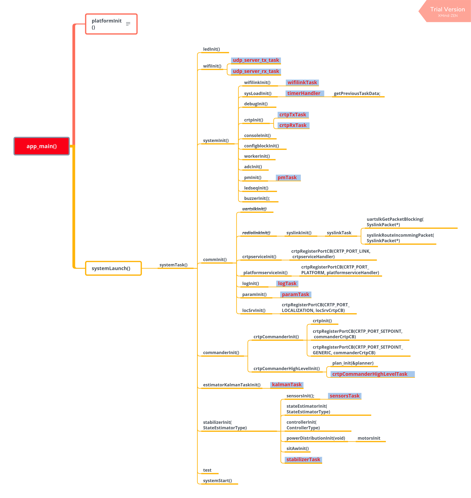
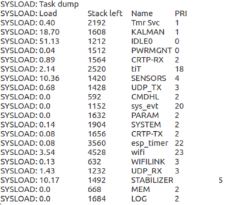
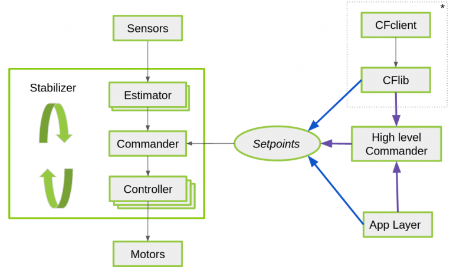
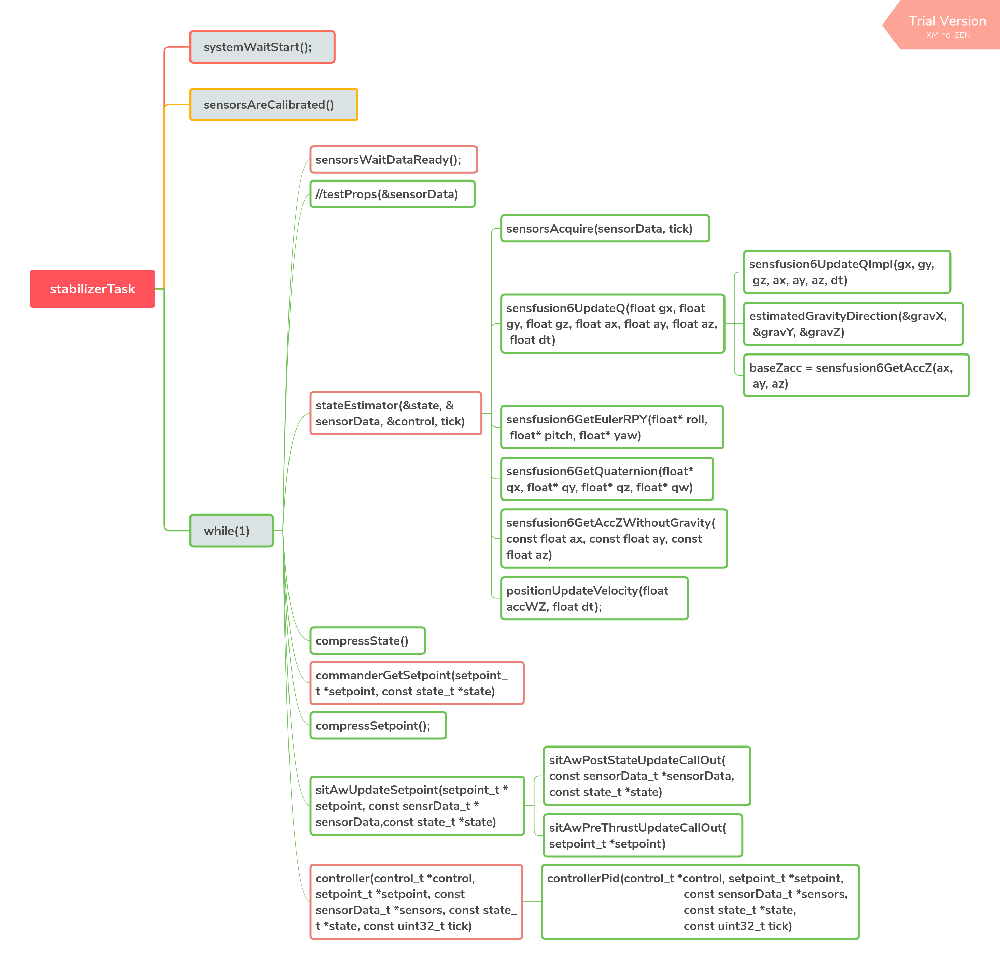

## 系统启动流程



查阅源文件：[start_from_app_main](../../_static/start_from_app_main.pdf)

## 系统任务管理

**系统正常运行时，将启动以下 TASK：**



* Load: CPU 占用率
* Stack Left：剩余堆栈空间
* Name：TASK 名称
* PRI: TASK 优先级

**系统任务简介：**

* PWRMGNT: 系统电压监测
* CMDHL: 应用层-处理根据 CRTP 协议构成的高级命令
* CRTP-RX: 协议层-CRTP 飞行协议解码
* CRTP-TX: 协议层-CRTP 飞行协议解码
* UDP-RX: 传输层-UDP 包接收
* UDP-TX: 传输层-UDP 包发送
* WIFILINK: 对接 CRTP 协议层和 UDP 传输层
* SENSORS: 传感器数据读取和预处理
* KALMAN: 使用传感器数据进行飞机状态估计，包括飞机角度、角速度、空间位置的估计。该 TASK 在 ESP 芯片上 CPU 资源消耗较大，应该注意优先级的分配。
* PARAM: 使用 CRTP 协议远程修改变量
* LOG: 使用 CRTP 协议实时监视变量
* MEM: 使用 CRTP 协议远程修改存储器
* STABILIZER: 自稳定线程，控制飞控程序运行流程
* SYSTEM: 控制系统初始化和自检流程

**TASK 堆栈空间配置**

可以在 `components/config/include/config.h` 中直接修改空间大小，也可以在 `menucfg` 中修改 `BASE_STACK_SIZE` 大小。使用 `ESP32` 时可将 `BASE_STACK_SIZE` 调整为 2048，减小踩空间的概率，使用 `ESP32S2` 时，建议将该值调整为 `1024`。

```
//Task stack sizes
#define SYSTEM_TASK_STACKSIZE         (4* configBASE_STACK_SIZE)
#define ADC_TASK_STACKSIZE            configBASE_STACK_SIZE
#define PM_TASK_STACKSIZE             (2*configBASE_STACK_SIZE)
#define CRTP_TX_TASK_STACKSIZE        (2*configBASE_STACK_SIZE)
#define CRTP_RX_TASK_STACKSIZE        (2* configBASE_STACK_SIZE)
#define CRTP_RXTX_TASK_STACKSIZE      configBASE_STACK_SIZE
#define LOG_TASK_STACKSIZE            (2*configBASE_STACK_SIZE)
#define MEM_TASK_STACKSIZE            (1 * configBASE_STACK_SIZE)
#define PARAM_TASK_STACKSIZE          (2*configBASE_STACK_SIZE)
#define SENSORS_TASK_STACKSIZE        (2 * configBASE_STACK_SIZE)
#define STABILIZER_TASK_STACKSIZE     (2 * configBASE_STACK_SIZE)
#define NRF24LINK_TASK_STACKSIZE      configBASE_STACK_SIZE
#define ESKYLINK_TASK_STACKSIZE       configBASE_STACK_SIZE
#define SYSLINK_TASK_STACKSIZE        configBASE_STACK_SIZE
#define USBLINK_TASK_STACKSIZE        configBASE_STACK_SIZE
#define WIFILINK_TASK_STACKSIZE        (2*configBASE_STACK_SIZE)
#define UDP_TX_TASK_STACKSIZE   (2*configBASE_STACK_SIZE)
#define UDP_RX_TASK_STACKSIZE   (2*configBASE_STACK_SIZE)
#define UDP_RX2_TASK_STACKSIZE   (1*configBASE_STACK_SIZE)
#define PROXIMITY_TASK_STACKSIZE      configBASE_STACK_SIZE
#define EXTRX_TASK_STACKSIZE          configBASE_STACK_SIZE
#define UART_RX_TASK_STACKSIZE        configBASE_STACK_SIZE
#define ZRANGER_TASK_STACKSIZE        (1* configBASE_STACK_SIZE)
#define ZRANGER2_TASK_STACKSIZE       (2* configBASE_STACK_SIZE)
#define FLOW_TASK_STACKSIZE           (2* configBASE_STACK_SIZE)
#define USDLOG_TASK_STACKSIZE         (1* configBASE_STACK_SIZE)
#define USDWRITE_TASK_STACKSIZE       (1* configBASE_STACK_SIZE)
#define PCA9685_TASK_STACKSIZE        (1* configBASE_STACK_SIZE)
#define CMD_HIGH_LEVEL_TASK_STACKSIZE (1* configBASE_STACK_SIZE)
#define MULTIRANGER_TASK_STACKSIZE    (1* configBASE_STACK_SIZE)
#define ACTIVEMARKER_TASK_STACKSIZE   configBASE_STACK_SIZE
#define AI_DECK_TASK_STACKSIZE        configBASE_STACK_SIZE
#define UART2_TASK_STACKSIZE          configBASE_STACK_SIZE
```


**TASK 优先级配置**

系统 TASK 优先级可以在 `components/config/include/config.h` 中进行配置，由于 `ESP32` 具有双核优势，相比 `ESP32S2` 计算资源更加富余，可将高耗时的 `KALMAN_TASK` 优先级调高。 在使用 `ESP32S2` 时，需要将高耗时的 `KALMAN_TASK` 优先级调低，否者难以释放足够的 CPU 资源，将触发 task watchdog。

```
// Task priorities. Higher number higher priority
#define STABILIZER_TASK_PRI     5
#define SENSORS_TASK_PRI        4
#define ADC_TASK_PRI            3
#define FLOW_TASK_PRI           3
#define MULTIRANGER_TASK_PRI    3
#define SYSTEM_TASK_PRI         2
#define CRTP_TX_TASK_PRI        2
#define CRTP_RX_TASK_PRI        2
#define EXTRX_TASK_PRI          2
#define ZRANGER_TASK_PRI        2
#define ZRANGER2_TASK_PRI       2
#define PROXIMITY_TASK_PRI      0
#define PM_TASK_PRI             0
#define USDLOG_TASK_PRI         1
#define USDWRITE_TASK_PRI       0
#define PCA9685_TASK_PRI        2
#define CMD_HIGH_LEVEL_TASK_PRI 2
#define BQ_OSD_TASK_PRI         1
#define GTGPS_DECK_TASK_PRI     1
#define LIGHTHOUSE_TASK_PRI     3
#define LPS_DECK_TASK_PRI       5
#define OA_DECK_TASK_PRI        3
#define UART1_TEST_TASK_PRI     1
#define UART2_TEST_TASK_PRI     1
//if task watchdog triggered,KALMAN_TASK_PRI should set lower or set lower flow frequency
#ifdef TARGET_MCU_ESP32
  #define KALMAN_TASK_PRI         2
  #define LOG_TASK_PRI            1
  #define MEM_TASK_PRI            1
  #define PARAM_TASK_PRI          1
#else
  #define KALMAN_TASK_PRI         1
  #define LOG_TASK_PRI            2
  #define MEM_TASK_PRI            2
  #define PARAM_TASK_PRI          2
#endif

#define SYSLINK_TASK_PRI        3
#define USBLINK_TASK_PRI        3
#define ACTIVE_MARKER_TASK_PRI  3
#define AI_DECK_TASK_PRI        3
#define UART2_TASK_PRI          3
#define WIFILINK_TASK_PRI       3
#define UDP_TX_TASK_PRI         3
#define UDP_RX_TASK_PRI         3
#define UDP_RX2_TASK_PRI        3
```

## 关键 TASK 介绍

除了系统默认开启的 task（如 wifi task），优先级最高的 task 是 `STABILIZER_TASK`，凸显了这个任务的重要性。`STABILIZER_TASK` 控制了从传感器数据读取，到姿态计算，到目标接收，到最终输出电机功率的整个过程，驱动各个阶段的算法运行。




