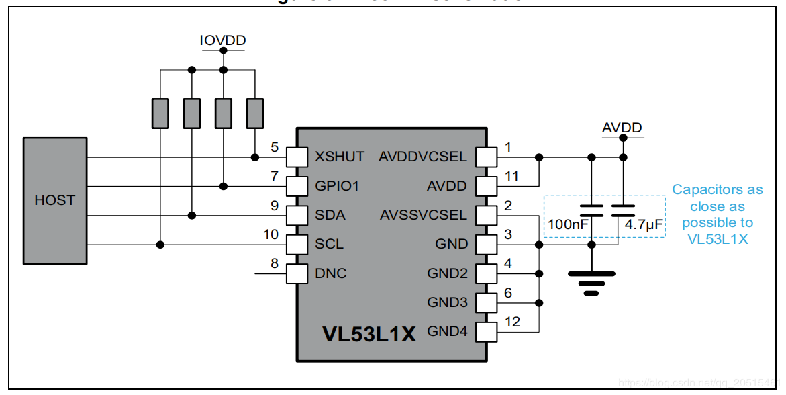
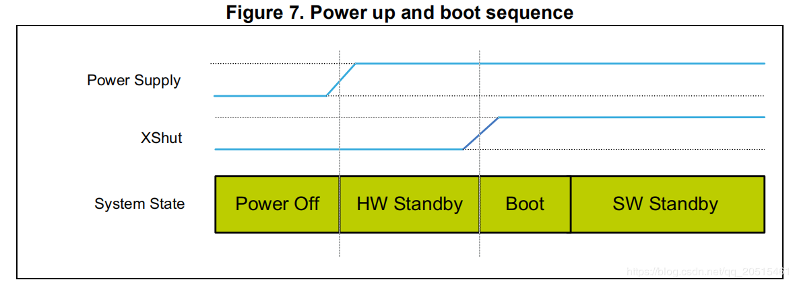
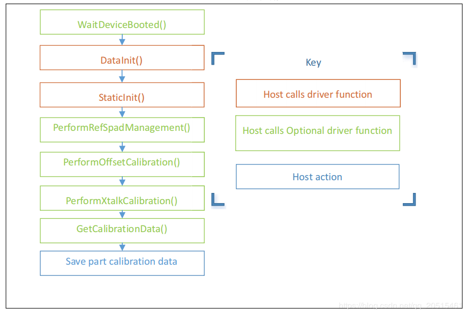

## VL53LXX 传感器特性

**工作原理**

VL53L0X / VL53L1X 芯片内部集成了激光发射器和 SPAD 红外接收器，通过探测光子发送和接收时间差，计算光子飞行距离，最远测量距离可达两米，适合中短距离测量的应用。


 
**测量区域 - ROI**

VL53L0X / VL53L1X 的测量值为测量区域中的最短距离，测量区域可以根据使用场景进行放大或收缩，较大的探测范围可能会引起测量值的波动。

> 测量区域的配置参见 2.4 ranging description 2.8 Sensing array optical center


**测量距离**

* VL53L0X 传感器存在 **3-4 cm 的盲区**，有效测量范围 3cm-200cm，精度 +-3%
* VL53L1X 是 VL53L0X 的升级版本，探测距离可达 400 cm


* VL53LXX 测量距离与光线环境有关，黑暗环境下可获得更高的探测距离，在室外强光下，激光传感器可能会受到很大的干扰，导致测量精度降低，因此室外需要结合气压定高。


**测量频率**

* VL53L0X 响应频率最快可达 50 Hz，测量误差+-5%
* VL53L1X I2C 最大时钟频率可达 400khz，上拉电阻需要根据电压和总线电容值选择，可以参见vl53l1x datasheet



* XSHUT 为输入引脚，用于模式选择（休眠），需要上拉电阻放置漏电流
* GPIO1 为中断输出引脚，用于输出测量 dataready 中断

**工作模式**

通过设置 XSHUT 引脚的电平，可以切换传感器进入 HW Standby 模式或 SW Standby 模式，实现有条件的启动，降低待机功耗。如果主机放弃对传感器模式进行管理，可将 XSHUT 引脚默认为上拉。

* HW Standby ：XSHUT拉低时，传感器电源被关闭
* SW Standby ：XSHUT拉高，进入boot和SW Standby 模式




## VL53LXX 初始化步骤

1. 等待硬件初始化完成
2. 数据初始化
3. 静态初始化，装载数据
4. 设置测量距离模式
5. 设置单次测量最长等待时间
6. 设置测量频率（时间间隔）
7. 设置测量区域 ROI（可选）
8. 启动测量

```text
/*init  vl53l1 module*/
void vl53l1_init()
{

    Roi0.TopLeftX = 0;    //测量目标区 可选最小4*4，最大16*16
    Roi0.TopLeftY = 15;
    Roi0.BotRightX = 7;
    Roi0.BotRightY = 0;
    Roi1.TopLeftX = 8;
    Roi1.TopLeftY = 15;
    Roi1.BotRightX = 15;
    Roi1.BotRightY = 0;

    int status = VL53L1_WaitDeviceBooted(Dev); //等待硬件初始化完成
    status = VL53L1_DataInit(Dev); //数据初始化，上电后立刻执行
    status = VL53L1_StaticInit(Dev); //静态初始化，装载参数
    status = VL53L1_SetDistanceMode(Dev, VL53L1_DISTANCEMODE_LONG);//设置测量模式
    status = VL53L1_SetMeasurementTimingBudgetMicroSeconds(Dev, 50000); //设置最长时间，根据测量模式确定
    status = VL53L1_SetInterMeasurementPeriodMilliSeconds(Dev, 100); //测量间隔

    status = VL53L1_SetUserROI(Dev, &Roi0); //设置ROI
    status = VL53L1_StartMeasurement(Dev); //启动测量
    if(status) {
        printf("VL53L1_StartMeasurement failed \n");
        while(1);
    }    

}
```

* 以上初始化步骤除 VL53L1\_SetUserROI，其余不可少

## VL53LXX 测距步骤

**轮寻测量模式**

轮训测量流程图：


* 注意在完成一次测量和读取后，需要使用`VL53L1_ClearInterruptAndStartMeasurement`清除中断标志并重新开始。
* 轮训测量有两种方法，如上图所示，一种是阻塞方式（drivers polling mode），一种是非阻塞方式（Host polling mode），以下代码为阻塞测量方式。

```text
/* Autonomous ranging loop*/
static void
AutonomousLowPowerRangingTest(void)
{
    printf("Autonomous Ranging Test\n");

    static VL53L1_RangingMeasurementData_t RangingData;
    VL53L1_UserRoi_t Roi1;
    int roi = 0;
    float left = 0, right = 0;
    if (0/*isInterrupt*/) {
    } else {
        do // polling mode
            {
                int status = VL53L1_WaitMeasurementDataReady(Dev); //等待测量结果
                if(!status) {
                    status = VL53L1_GetRangingMeasurementData(Dev, &RangingData); //获取单次测量数据
                    if(status==0) {
                        if (roi & 1) {
                            left = RangingData.RangeMilliMeter;
                            printf("L %3.1f R %3.1f\n", right/10.0, left/10.0);
                        } else
                            right = RangingData.RangeMilliMeter;
                    }
                    if (++roi & 1) {
                        status = VL53L1_SetUserROI(Dev, &Roi1);
                    } else {
                        status = VL53L1_SetUserROI(Dev, &Roi0);
                    }
                    status = VL53L1_ClearInterruptAndStartMeasurement(Dev); //释放中断
                }
            }
        while (1);
    }
    //  return status;
}
```

**中断测量模式**

中断测量模式需要使用中断引脚 GPIO1，在数据 ready 时，GPIO1 引脚电平将被拉低，通知主机进行数据读取。


## 传感器校准

如果在传感器接收器上方添加了光罩，或者传感器藏在透明的盖板背后，由于透光率的变化，需要对传感器进行校准，可以根据校准流程调用 API 编写校准程序，也可以使用官方提供的 GUI 上位机直接测量出校准值。

**使用官方 API 编写校准程序**

校准流程：调用顺序要完全一致。



```
/*Calibration  vl53l1 module*/
static VL53L1_CalibrationData_t vl53l1_calibration(VL53L1_Dev_t *dev)
{
    int status;
    int32_t targetDistanceMilliMeter = 703;
    VL53L1_CalibrationData_t calibrationData;
    status = VL53L1_WaitDeviceBooted(dev);
    status = VL53L1_DataInit(dev);                                       //performs the device initialization
    status = VL53L1_StaticInit(dev);                                     // load device settings specific for a given use case.
    status = VL53L1_SetPresetMode(dev,VL53L1_PRESETMODE_AUTONOMOUS);
    status = VL53L1_PerformRefSpadManagement(dev);
    status = VL53L1_PerformOffsetCalibration(dev,targetDistanceMilliMeter);
    status = VL53L1_PerformSingleTargetXTalkCalibration(dev,targetDistanceMilliMeter);
    status = VL53L1_GetCalibrationData(dev,&calibrationData);

    if (status)
    {
        ESP_LOGE(TAG, "vl53l1_calibration failed \n");
        calibrationData.struct_version = 0;
        return calibrationData;

    }else
    {
        ESP_LOGI(TAG, "vl53l1_calibration done ! version = %u \n",calibrationData.struct_version);
        return calibrationData;
    }

}
```

**使用官方 GUI 上位机校准传感器**

官方提供了用于配置和校准传感器的 GUI 上位机，配合 ST 官方 `STM32F401RE nucleo` 开发板连接传感器，使用软件校准得到基准值后，初始化时填入的即可。

>

>[STSW-IMG008:Windows Graphical User Interface \(GUI\) for VL53L1X Nucleo packs. Works with P-NUCLEO-53L1A1 ](https://www.st.com/content/st_com/en/products/embedded-software/proximity-sensors-software/stsw-img008.html)

## ESP32 + VL53L1x 例程

**例程说明**

1. 实现功能：通过VL53L1x 检测到高度变化（持续一秒），红灯亮起。高度恢复正常值（持续一秒），绿灯亮起。
2. 可配置参数：通过make menuconfig 设置I2C 号码、端口号、LED端口号
3. 例程解析见代码注释与用户手册

**注意事项**

4. 该例程只适用于VL53L1x，寄送的传感器为该型号。VL53L0x为老版本硬件，不适用本例程。
5. 官方标称400cm测量距离，为黑暗环境下测得。室内正常灯光环境，可以保证10cm-260cm范围的有效测量
6. 初始化函数vl53l1\_init（VL53L1\_Dev\_t \*） 中部分参数，需要根据实际使用环境确定，还有优化的空间。
7. 传感器安装位置应确保在检测位置正上方
8. 模块上电时自动矫正基准高度，如果基准高度有变化，需要重新上电重置参数

**例程仓库**

[esp32-vl53l1x-test](https://github.com/qljz1993/esp32-vl53l1x-test/tree/master) 或者：

```text
git clone https://github.com/qljz1993/esp32-vl53l1x-test.git
```

